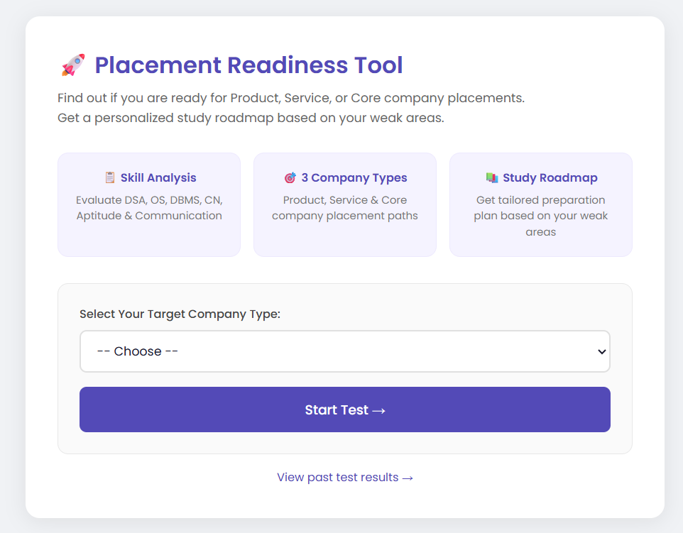
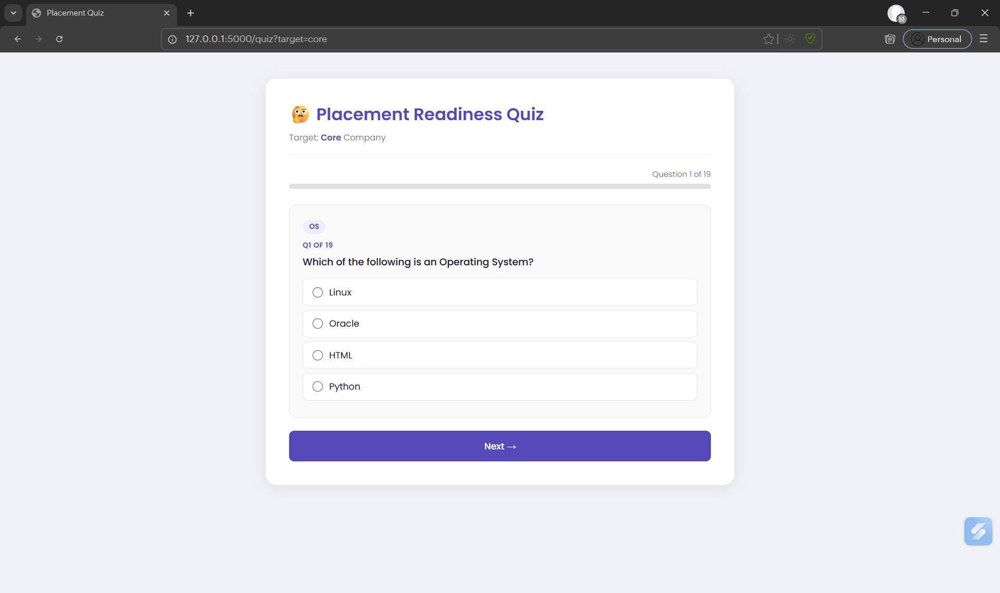
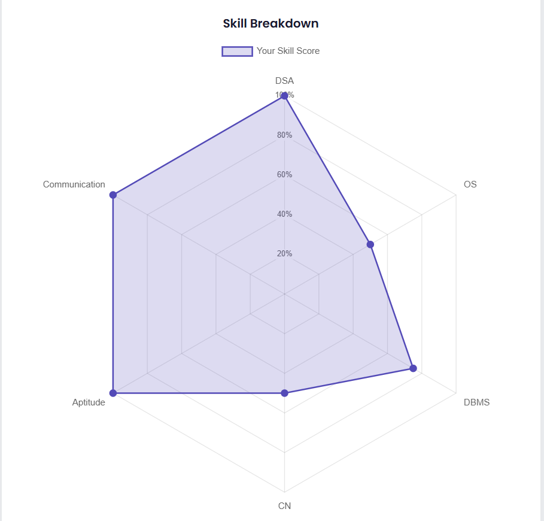
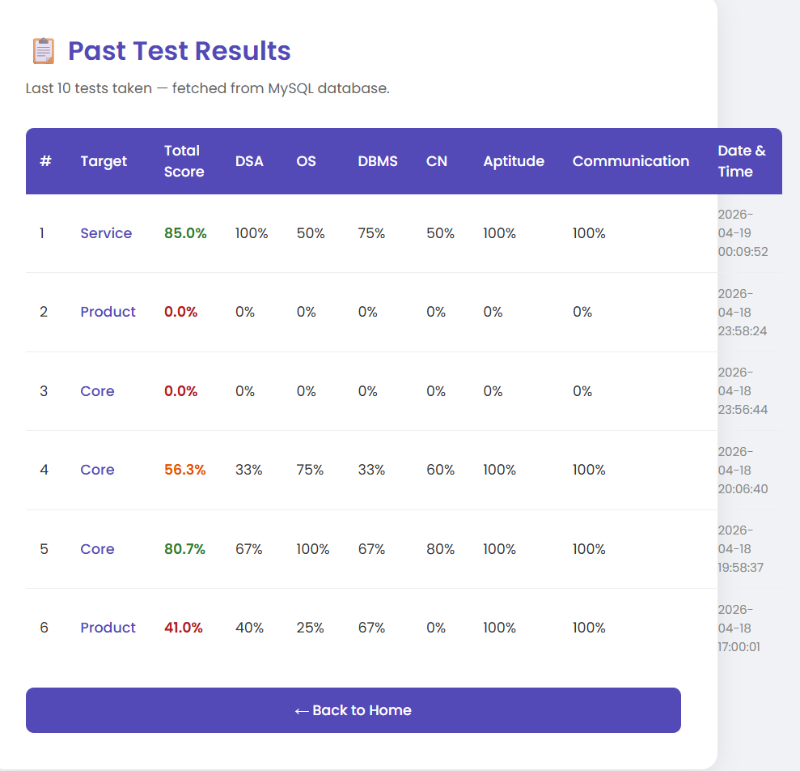
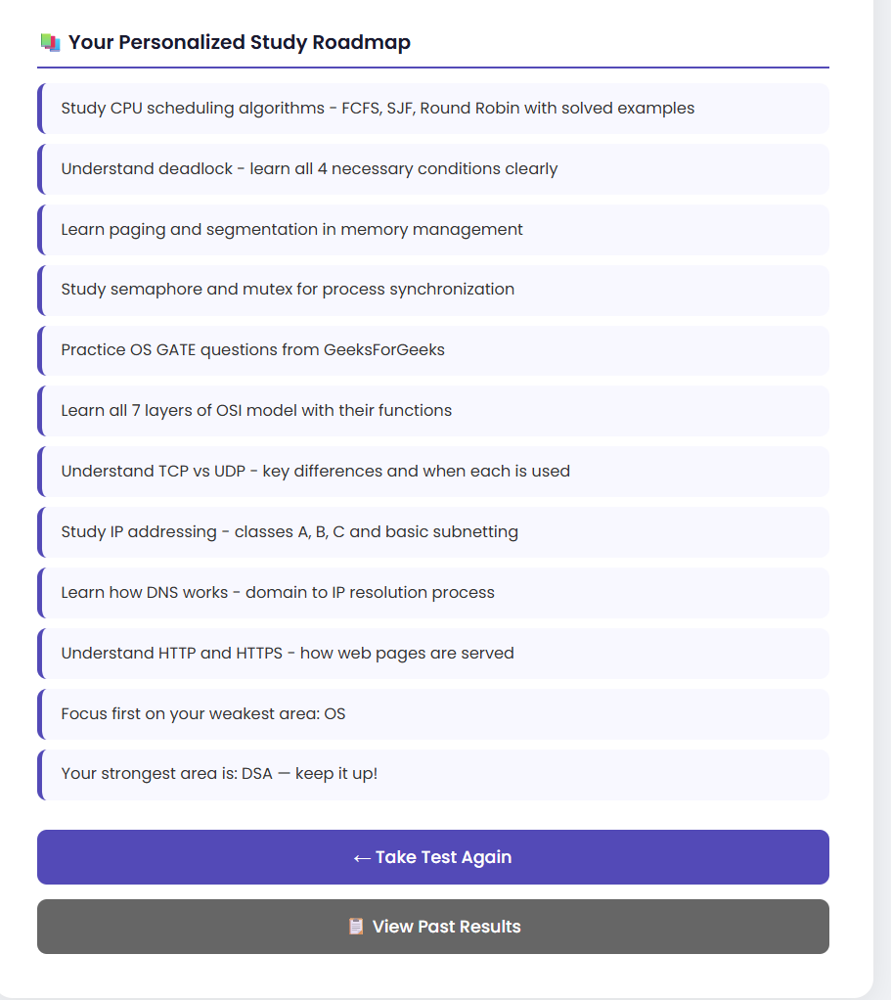

# 🚀 Placement Readiness Analyzer

> A Flask + MySQL web application that helps engineering students assess 
> their placement readiness for Product, Service, and Core companies — 
> with a personalized study roadmap.

---

## 🎯 What Problem Does It Solve?

Most students don't know which company type they are ready for until 
they fail actual interviews. This tool lets you self-assess early, 
identify specific weak areas, and get a targeted study plan before 
placement season starts.

---

## ✨ Features

- **Skill Assessment** across 6 categories — DSA, OS, DBMS, CN, Aptitude, Communication
- **Weighted Scoring** — same student, different company target = different score
- **3 Company Tracks** — Product (Google/Amazon), Service (TCS/Infosys), Core (DRDO/ISRO)
- **Radar Chart** visualization of your skill profile (Chart.js)
- **Personalized Roadmap** — study tips generated for your weak areas
- **MySQL History** — all test results saved and viewable

---

## 🛠️ Tech Stack

| Layer | Technology |
|-------|-----------|
| Backend | Python 3, Flask |
| Database | MySQL 8.0 |
| Frontend | HTML5, CSS3, JavaScript |
| Charts | Chart.js |
| Libraries | mysql-connector-python, matplotlib |

---

## 📁 Project Structure
# 🚀 Placement Readiness Analyzer

> A Flask + MySQL web application that helps engineering students assess 
> their placement readiness for Product, Service, and Core companies — 
> with a personalized study roadmap.

---

## 🎯 What Problem Does It Solve?

Most students don't know which company type they are ready for until 
they fail actual interviews. This tool lets you self-assess early, 
identify specific weak areas, and get a targeted study plan before 
placement season starts.

---

## ✨ Features

- **Skill Assessment** across 6 categories — DSA, OS, DBMS, CN, Aptitude, Communication
- **Weighted Scoring** — same student, different company target = different score
- **3 Company Tracks** — Product (Google/Amazon), Service (TCS/Infosys), Core (DRDO/ISRO)
- **Radar Chart** visualization of your skill profile (Chart.js)
- **Personalized Roadmap** — study tips generated for your weak areas
- **MySQL History** — all test results saved and viewable

---

## 🛠️ Tech Stack

| Layer | Technology |
|-------|-----------|
| Backend | Python 3, Flask |
| Database | MySQL 8.0 |
| Frontend | HTML5, CSS3, JavaScript |
| Charts | Chart.js |
| Libraries | mysql-connector-python, matplotlib |

---

## 📁 Project Structure
# 🚀 Placement Readiness Analyzer

> A Flask + MySQL web application that helps engineering students assess 
> their placement readiness for Product, Service, and Core companies — 
> with a personalized study roadmap.

---

## 🎯 What Problem Does It Solve?

Most students don't know which company type they are ready for until 
they fail actual interviews. This tool lets you self-assess early, 
identify specific weak areas, and get a targeted study plan before 
placement season starts.

---

## ✨ Features

- **Skill Assessment** across 6 categories — DSA, OS, DBMS, CN, Aptitude, Communication
- **Weighted Scoring** — same student, different company target = different score
- **3 Company Tracks** — Product (Google/Amazon), Service (TCS/Infosys), Core (DRDO/ISRO)
- **Radar Chart** visualization of your skill profile (Chart.js)
- **Personalized Roadmap** — study tips generated for your weak areas
- **MySQL History** — all test results saved and viewable

---

## 🛠️ Tech Stack

| Layer | Technology |
|-------|-----------|
| Backend | Python 3, Flask |
| Database | MySQL 8.0 |
| Frontend | HTML5, CSS3, JavaScript |
| Charts | Chart.js |
| Libraries | mysql-connector-python, matplotlib |

---

## 📁 Project Structure

placement-readiness-analyzer/
│
├── app.py              ← Flask routes (home, quiz, result, history)
├── config.py           ← MySQL connection + skill weights
├── scoring.py          ← Weighted scoring logic
├── roadmap.py          ← Gap analysis + study roadmap generation
├── visual.py           ← Matplotlib bar chart generation
│
├── questions.json      ← Question bank (separate sets per company type)
├── resources.json      ← Study resources per category
│
├── templates/
│   ├── home.html       ← Landing page
│   ├── quiz.html       ← One-question-at-a-time quiz
│   ├── result.html     ← Score card + radar chart + roadmap
│   └── history.html    ← Past results from MySQL
│
└── static/
└── style.css       ← Styling (Poppins font, responsive)

---

## ⚙️ Setup & Run

### Prerequisites
- Python 3.9+
- MySQL 8.0
- pip

### Steps

```bash
# 1. Clone the repository
git clone https://github.com/the-parthmishra/placement-readiness-analyzer.git
cd placement-readiness-analyzer

# 2. Create virtual environment
python -m venv venv
venv\Scripts\activate        # Windows
# source venv/bin/activate   # Mac/Linux

# 3. Install dependencies
pip install -r requirements.txt

# 4. Create MySQL database
# Open MySQL Workbench and run:
CREATE DATABASE placement_tool;
USE placement_tool;
CREATE TABLE results (
    id INT AUTO_INCREMENT PRIMARY KEY,
    target VARCHAR(20),
    total_score FLOAT,
    dsa FLOAT, os FLOAT, dbms FLOAT,
    cn FLOAT, aptitude FLOAT, communication FLOAT,
    created_at TIMESTAMP DEFAULT CURRENT_TIMESTAMP
);

# 5. Update your MySQL password in config.py
# Change: password="" to your actual MySQL password

# 6. Run the app
python app.py

# 7. Open in browser
# http://127.0.0.1:5000
```

---

## 🧠 How the Scoring Works

The core feature is **weighted scoring** — different skill weights per company type:

| Category | Product | Service | Core |
|----------|---------|---------|------|
| DSA | 40% | 10% | 20% |
| OS | 20% | 10% | 20% |
| DBMS | 15% | 20% | 20% |
| CN | 15% | 10% | 30% |
| Aptitude | 5% | 40% | 5% |
| Communication | 5% | 10% | 5% |

Same student, different target = different readiness score. This reflects 
real placement criteria — Google cares about DSA, TCS cares about aptitude.

---

## 🗄️ Database

Results are stored in MySQL with per-category scores. The `/history` page 
fetches the last 10 attempts using:
```sql
SELECT target, total_score, created_at 
FROM results 
ORDER BY created_at DESC 
LIMIT 10
```

---

## 🔮 Future Scope

- Student login system for personalized history tracking
- Difficulty levels (easy/medium/hard) with weighted marks
- Admin panel for adding questions without editing JSON
- Timer per question for exam simulation

---

## 📸 Screenshots







---

## 👤 Author

**Parth Mishra** — BCA Final Year Project  
[GitHub](https://github.com/the-parthmishra)
